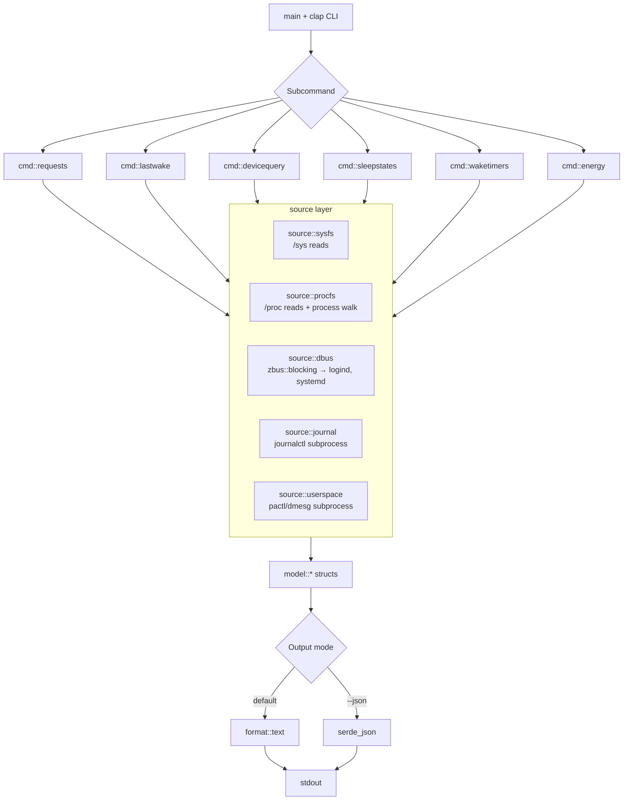
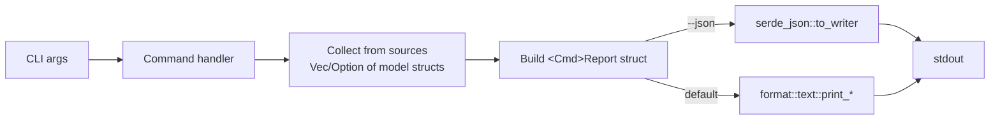

# powercfg Rust Rewrite

## Overview

The current `powercfg.py` is a single-file, 1353-line Python 3 CLI that exposes a Linux equivalent of Windows' `powercfg` command. It has six subcommands (`requests`, `lastwake`, `devicequery`, `sleepstates`, `waketimers`, `energy`) and obtains data by reading sysfs/procfs and shelling out to `systemd-inhibit`, `systemctl`, `journalctl`, `pactl`, `pgrep`, `ss`, and `dmesg`. (The Python source also references `busctl`, but that code path is dead — `get_systemd_inhibitors_dbus` returns an empty list. It is not ported.)

The Rust rewrite **does not preserve the data-acquisition strategy**. Where Python shells out and parses CLI output, Rust talks to the underlying typed APIs directly when one exists — `zbus` for systemd-logind and systemd-manager, direct `/proc` walking for process discovery. Subprocess remains only where it is the canonical interface (`journalctl`, `dmesg`, `pactl`).

This document designs a Rust rewrite that:

1. Preserves the exact CLI surface and default text output (so existing scripts and muscle memory continue to work).
2. Replaces the single-file structure with a small, testable module layout.
3. Adds an optional `--json` output mode for machine consumption — a feature the Python version lacks.
4. Distributes as a single static-ish binary that needs only a working systemd userspace at runtime.

The new binary is named `powercfg` from day one and replaces `powercfg.py` in-place. The Python source is deleted in the same change that lands the Rust implementation; git history is the only retention mechanism.

## Architecture

### Components



| Module | Responsibility |
|--------|----------------|
| `main.rs` | Entry point; dispatch to command handlers; set process exit code. |
| `cli.rs` | clap derive structs for global flags and per-subcommand args. |
| `cmd/{requests,lastwake,devicequery,sleepstates,waketimers,energy}.rs` | Each subcommand: orchestrate data collection, populate a single output struct, hand to formatter. |
| `source/sysfs.rs` | Read `/sys/power/{state,mem_sleep,disk,wake_lock,pm_wakeup_irq,image_size}`, `/sys/bus/usb/devices/*`, `/sys/bus/pci/devices/*` (including `power/{wakeup_count,wakeup_active_count,wakeup_last_time_ms}`), `/sys/class/power_supply/*`, `/sys/class/thermal/thermal_zone*/mode`, `/sys/class/hwmon/*`, `/sys/class/rtc/rtc0/wakealarm`, `/sys/devices/system/cpu/cpu0/cpufreq/*`, `/sys/devices/system/cpu/cpu*/thermal_throttle/package_throttle_count`. |
| `source/procfs.rs` | Read `/proc/interrupts`, `/proc/swaps`, `/proc/acpi/wakeup`, walk `/proc/*/comm` and `/proc/*/cmdline` for VM detection. |
| `source/dbus.rs` | `zbus::blocking` proxies for `org.freedesktop.login1.Manager` (`ListInhibitors`) and `org.freedesktop.systemd1.Manager` (`ListUnits`, per-unit `WakeSystem` property). |
| `source/journal.rs` | Subprocess: `journalctl -k -o short-iso --no-pager --since=...`, parsing in-process. |
| `source/userspace.rs` | Subprocess: `pactl list sink-inputs short`, `dmesg --time-format=iso`. |
| `source/exec.rs` | Bounded subprocess helper (`run_with_timeout(cmd, timeout) -> Result<Output, ExecError>`). Used by `journal.rs` and `userspace.rs`. |
| `source/error.rs` | `SourceError` enum: `Io`, `Parse`, `Dbus`, `Subprocess`, `Timeout`, `NotFound`. Implements `Display`; sources return `Result<T, SourceError>`. |
| `model/` | Plain `serde::Serialize` structs: `Inhibitor`, `AcpiWakeDevice`, `UsbWakeDevice`, `WakeupStats`, `PowerSupply`, `CpuFreqInfo`, `ThermalReading`, `ThrottleStatus`, `WakeTimer`, `SleepEvent`, `SwapDevice`, `SleepStateInfo`, `RequestsReport`, `LastWakeReport`, `DeviceQueryReport`, `SleepStatesReport`, `WakeTimersReport`, `EnergyReport`. |
| `format/text.rs` | Section printers that reproduce the existing Python output verbatim. |
| `format/duration.rs` | `format_duration(Duration) -> String` (`1d 2h 3m 4s`). |
| `format/freq.rs` | `format_freq(khz) -> String` (`3.40 GHz`). |
| `time.rs` | ISO-8601 parsing helpers handling both `±HH:MM` and `±HHMM` offsets. |
| `paths.rs` | `SysRoot` newtype (defaults to `/`) so integration tests can point at fixture trees. |

The split is deliberate: **command modules orchestrate; source modules collect; format modules render.** No source module prints to stdout, and no command module reads sysfs directly.

### Data Flow



Each command handler builds a single owning struct (e.g. `RequestsReport { inhibitors, wake_locks, audio, vms, usb_wakeup }`) and either serializes it to JSON or hands it to a section-by-section text printer. This is the key win over the Python version, where data collection and `print()` calls are interleaved.

### Interfaces

**External (user-facing) — unchanged from Python tool:**

```
powercfg requests        [-v]
powercfg lastwake        [-v] [-n N]
powercfg devicequery     [-v] [--enabled-only]
powercfg sleepstates     [-v]
powercfg waketimers      [-v]
powercfg energy          [-v]
```

**New global flags:**
- `--json` — emit the report struct as JSON instead of text.

(No `--no-color` flag in v1: the Python tool emits no ANSI codes, so there is nothing to disable. If colored output is added in v2 a corresponding flag lands then.)

**Internal — source layer signature pattern:**

```rust
// Every source function returns Result<T, SourceError>.
// "Absent data is fine" is a presentation decision, not a source concern —
// the command layer applies .unwrap_or_default() / .ok() at the call site.

pub fn read_acpi_wakeup(root: &SysRoot) -> Result<Vec<AcpiWakeDevice>, SourceError>;
pub fn read_power_supplies(root: &SysRoot) -> Result<Vec<PowerSupply>, SourceError>;
pub fn read_cpu_freq_info(root: &SysRoot) -> Result<CpuFreqInfo, SourceError>;
pub fn read_pci_wakeup_stats(root: &SysRoot, addr: &str) -> Result<WakeupStats, SourceError>;

// D-Bus sources via zbus::blocking — typed inputs, typed outputs.
pub fn list_inhibitors(conn: &Connection) -> Result<Vec<Inhibitor>, SourceError>;
pub fn list_systemd_timers(conn: &Connection) -> Result<Vec<TimerEntry>, SourceError>;

// Process walk — no pgrep subprocess.
pub fn find_processes_by_comm(root: &SysRoot, names: &[&str]) -> Result<Vec<ProcessInfo>, SourceError>;

// Journal stays subprocess (journalctl is the canonical interface).
pub fn last_kernel_event(matcher: &str, since: &str) -> Result<Option<DateTime<FixedOffset>>, SourceError>;
pub fn list_kernel_events(matcher: &str, since: &str) -> Result<Vec<SleepEvent>, SourceError>;
```

`journalctl` is invoked with explicit args (no `Command::new("sh").arg("-c")` and no shell pipelines); filtering happens in-process.

Errors below the command layer are logged at `debug!` level and converted to "no data". This matches the Python `try/except: pass` pattern but keeps the failure observable when `RUST_LOG=debug`.

## Design Decisions

### Decision 1: Single binary crate, not a workspace

**Context:** The tool is small (~1.3 KLOC of Python). A workspace would add ceremony for no payoff.

**Options Considered:**
1. Single binary crate with internal modules.
2. Workspace with `powercfg-core` library + `powercfg-cli` binary.
3. Two binaries (`powercfg` + `powercfgd` daemon) — out of scope, no daemon planned.

**Decision:** Single binary crate.

**Rationale:** No second consumer of the data-collection code is planned. If one appears (e.g., a Prometheus exporter), the source modules can be extracted into a library later — the module boundaries already permit this. YAGNI applies.

### Decision 2: clap derive API for argument parsing

**Context:** The Python tool uses `argparse` with `subparsers`. We need the same shape in Rust.

**Options Considered:**
1. `clap` v4 derive API.
2. `clap` v4 builder API.
3. `argh` (Google's lightweight parser).
4. Hand-rolled parser.

**Decision:** clap v4 derive API.

**Rationale:** clap is the de facto standard, supports nested subcommands cleanly via `#[derive(Subcommand)]`, generates good `--help` automatically, and keeps the CLI definition close to the structs it populates. The compile-time cost is acceptable for a CLI.

### Decision 3: `zbus::blocking` for systemd, subprocess only where it's the canonical interface

**Context:** Inhibitors, timer units, and the journal can be retrieved either by running `systemd-inhibit`/`systemctl`/`journalctl` (as the Python tool does) or by talking to systemd directly via D-Bus.

**Options Considered:**
1. Subprocess everything (parity with Python).
2. `zbus` (pure-Rust D-Bus) blocking API for logind + systemd-manager; subprocess for `journalctl` (no clean library alternative) and `dmesg`/`pactl`.
3. `dbus-rs` (libdbus FFI) — smaller transitive deps but adds a C runtime dependency that breaks musl static builds.
4. `systemd` crate (libsystemd FFI) — same musl problem.

**Decision:** Option 2. `zbus::blocking::Connection::system()` for `org.freedesktop.login1.Manager.ListInhibitors` and `org.freedesktop.systemd1.Manager.ListUnits` + per-unit `WakeSystem` property reads. `journalctl` and `dmesg` remain subprocess because they are the canonical interfaces and have no equivalent typed API in zbus' surface. `pactl` remains subprocess because PulseAudio/PipeWire D-Bus is fragmented across two protocols and the `pactl` text format is more stable than either.

**Rationale:** The Python tool shells out because Python's D-Bus story is bad. Rust's isn't. Parsing `systemd-inhibit --list --no-legend` columnar output with `splitn(7, char::is_whitespace)` is fragile — that output isn't a stable API contract. The D-Bus call returns `a(ssssuu)` directly: typed, versioned, contract-stable. The compile-time cost of zbus' transitive crates is real but it's a one-time cost paid once per developer/CI cache; the parsing-fragility cost is paid forever.

zbus also kills the N+1 subprocess pattern in `waketimers`: instead of one `systemctl show --property=WakeSystem` per unit (50 timers = 50 forks), one `ListUnits` + cheap per-unit property reads on a single connection.

zbus is pure Rust — `x86_64-unknown-linux-musl` static builds work without a C dependency.

**`busctl` note:** The Python source contains a `get_systemd_inhibitors_dbus` function that shells out to `busctl call ... ListInhibitors` but never parses the result. With zbus we go direct to D-Bus properly; `busctl` is not involved.

### Decision 3a: Walk `/proc` directly instead of shelling out to `pgrep`

**Context:** The Python tool runs `pgrep -a qemu` and `pgrep -a VBoxHeadless` to detect running VMs.

**Options Considered:**
1. Mirror Python: spawn `pgrep`, parse output.
2. Walk `/proc/*/comm` (and `/proc/*/cmdline` for verbose) ourselves.
3. Use the `procfs` crate.

**Decision:** Option 2. Iterate `/proc/`, filter to numeric directory names, read `comm` for each, match against the target list (`qemu`, `qemu-system-x86_64`, `qemu-system-aarch64`, `VBoxHeadless`).

**Rationale:** `pgrep` is itself just a `/proc` walker. We're already reading procfs for `/proc/interrupts`, `/proc/swaps`, `/proc/acpi/wakeup` — adding `/proc/*/comm` is one more iter. No subprocess overhead, no parsing of `pid name` lines, no surprises when `pgrep` isn't in `$PATH` (minimal containers, busybox systems). The `procfs` crate (Option 3) is well-made but the surface we need is ~10 lines of `std::fs` — a crate is over-engineering.

### Decision 4: Bound subprocess execution with `wait-timeout`

**Context:** The Python tool uses `subprocess.run(..., timeout=5/10/15)` to prevent a hung `journalctl` or `dmesg` from stalling the CLI. Rust's `std::process::Command` has no built-in timeout.

**Options Considered:**
1. `wait-timeout` crate — small, focused dependency.
2. Spawn a thread that kills the child after N seconds.
3. Use `tokio::process::Command` with `tokio::time::timeout`.
4. Skip timeouts entirely; trust the OS.

**Decision:** `wait-timeout` crate, wrapped in `source::exec::run_with_timeout`. **Fallback:** if `wait-timeout` proves stale (last release 2019, low maintenance signal) or fails to compile cleanly on edition 2021/2024, replace with a small in-tree helper that spawns the child, waits in a thread with a `recv_timeout` channel, and calls `child.kill()` on timeout. The `source::exec` module hides this choice from callers.

**Rationale:** `tokio` is overkill for a synchronous CLI. Skipping timeouts loses a real safety property (large journals on slow disks can take minutes). `wait-timeout` is ~150 lines and has no transitive dependencies, but its maintenance status is a real risk for a long-lived tool — hence the named fallback. The in-tree thread+kill alternative is ~30 lines and zero-dependency; the cost of writing it ourselves is bounded.

**Verification step before adopting `wait-timeout`:** confirm a clean `cargo build` on stable Rust ≥ 1.78 with edition 2024, and confirm no `unsoundness`/`unmaintained` advisories fire under `cargo deny check advisories`. If either fails, ship the in-tree helper instead.

### Decision 5: Optional `--json` output via serde

**Context:** The Python tool only emits formatted text. Users who script around it have to parse output with regex.

**Options Considered:**
1. Text only, exactly matching Python (no JSON).
2. JSON only.
3. Text by default, JSON behind a flag.

**Decision:** Option 3 — text by default, `--json` flag for structured output.

**Rationale:** Backward compatibility for humans; structured output for tooling. Implementation cost is minimal because the command modules already build a single owning report struct — adding `#[derive(Serialize)]` and one `serde_json::to_writer` call per command covers it.

**JSON schema sketches** (one per subcommand, fields shown with representative types; absent values use `null`, absent collections use `[]`):

```jsonc
// powercfg requests --json
{
  "inhibitors": [
    { "who": "string", "user": "string", "pid": 1234, "command": "string",
      "what": "sleep:idle", "why": "string" }
  ],
  "wake_locks": ["string", ...],
  "audio_streams": [{ "id": "42", "client": "Firefox" }],
  "vms": [{ "pid": "1234", "name": "QEMU/KVM VM" }],
  "usb_wakeup": [{ "device": "1-2", "name": "Logitech Receiver" }]
}

// powercfg lastwake --json
{
  "last_sleep": "2025-12-25T21:40:21-08:00" /* or null */,
  "last_wake":  "2025-12-25T22:10:33-08:00" /* or null */,
  "duration_seconds": 1812 /* or null */,
  "wake_irq": { "irq": "9", "device": "acpi" } /* or null */,
  "kernel_messages": ["string", ...] /* only if -v */,
  "acpi_enabled_devices": [
    { "device": "GPP0", "state": "S4", "sysfs": "pci:0000:00:01.1" }
  ] /* only if -v */,
  "history": [{ "time": "2025-12-25T21:40:21-08:00", "type": "sleep" }] /* only if -n */
}

// powercfg devicequery --json
{
  "acpi_devices": [
    { "device": "GPP0", "state": "S4", "enabled": true, "sysfs": "pci:0000:00:01.1",
      "description": "PCI Bridge",
      "stats": { "wakeup_count": 5, "wakeup_active_count": 5,
                 "wakeup_last_time_ms": 12345 } /* null unless -v */ }
  ],
  "usb_devices": [{ "device": "1-2", "name": "Logitech Receiver" }],
  "totals": { "enabled": 3, "total": 12 }
}

// powercfg sleepstates --json
{
  "states": ["freeze", "mem", "disk"],
  "mem_sleep": { "current": "deep", "available": ["s2idle", "deep"] },
  "hibernation": {
    "current_mode": "platform",
    "available_modes": ["platform", "shutdown", "reboot"],
    "swap": [{ "device": "/dev/dm-0", "type": "partition", "size_mb": 16384,
               "is_zram": false }],
    "image_size_mb": 4096 /* only if -v */
  } /* null if disk state unavailable */
}

// powercfg waketimers --json
{
  "wake_timers": [{ "unit": "snapshot.timer", "next": "2026-04-29 03:00:00 UTC" }],
  "all_timers":  [{ "unit": "...", "wakes": false, "next": "..." }] /* only if -v */,
  "rtc_wakealarm": "2026-04-29 06:00:00" /* or null */
}

// powercfg energy --json
{
  "supplies": [
    { "name": "BAT0", "type": "Battery", "status": "Discharging",
      "capacity_pct": 87, "level": "Normal", "power_uw": 12500000 }
  ],
  "cpu": {
    "driver": "amd-pstate-epp", "governor": "powersave",
    "cur_freq_khz": 3400000, "min_freq_khz": 400000, "max_freq_khz": 4800000,
    "epp": "balance_performance", "epp_available": ["performance", "..."],
    "cpu_count": 16
  },
  "temperatures": [{ "label": "Tctl", "temp_c": 52.4, "source": "k10temp" }],
  "throttle": { "throttled": false, "throttle_count": 0 }
}
```

These schemas are **stable contracts**: removing or renaming a field is a breaking change. Adding optional fields is non-breaking. The schemas live in this design doc until v1 ships, then move to `docs/json-schema.md` so users can reference them.

### Decision 6: `SysRoot` newtype for testable filesystem reads

**Context:** Sysfs/procfs reads are the riskiest parsing surface. We need to test parsers against captured fixtures without root or specific hardware.

**Options Considered:**
1. Read from `/` everywhere using hardcoded paths.
2. Pass a `&Path` root to each function.
3. Newtype `SysRoot(PathBuf)` with helper methods (`root.acpi_wakeup_path()`, `root.power_supply_dir()`).
4. Trait-object filesystem abstraction (`Box<dyn Filesystem>`).

**Decision:** Option 3 — `SysRoot` newtype.

**Rationale:** Option 1 makes integration testing impossible without `unshare`/containers. Option 2 spreads path concatenation throughout the source layer. Option 4 over-abstracts; we only need a path prefix. The newtype gives one place to centralize "where do these files live" and a clean test seam (`SysRoot::from(tempdir)`).

### Decision 7: Source layer returns `Result<T, SourceError>` with a typed error enum

**Context:** Most data sources fail in expected ways: file doesn't exist on this hardware, permission denied (some sysfs reads need root), command isn't installed, journal is empty, D-Bus call fails. The Python tool swallows these with bare `except`. The naive Rust port returns empty `Vec`/`None` to mimic that — a Python-ism that loses error context, breaks composition, and makes failure modes untestable.

**Options Considered:**
1. Source functions return `Vec<T>` / `Option<T>`; missing data == empty/None. (Python-shaped.)
2. Source functions return `Result<T, SourceError>` with a typed error enum; command layer applies `.unwrap_or_default()` / `.ok()` per call site to choose presentation behavior.
3. `anyhow::Error` everywhere — typed errors lose information in untyped wrappers.

**Decision:** Option 2.

**Rationale:** The "swallow and present empty" behavior is a *presentation* concern, not a source-layer concern. Pushing it into the source layer hides three things tests need to see:
- What kind of failure happened (parse vs I/O vs D-Bus vs missing binary).
- Whether a fallback was tried.
- Whether `--json` should serialize `null` (data unavailable) or `[]` (data was queryable but empty).

`SourceError` (in `source/error.rs`) is a small enum: `Io(std::io::Error)`, `Parse(String)`, `Dbus(zbus::Error)`, `Subprocess(ExecError)`, `NotFound(String)`. It implements `Display` and `std::error::Error`. `tracing::debug!("{err:#}")` formats the chain.

Command-layer call sites read like:

```rust
let inhibitors = source::dbus::list_inhibitors(&conn)
    .inspect_err(|e| tracing::debug!("inhibitors: {e}"))
    .unwrap_or_default();
```

Three lines instead of an `unwrap_or_default()`, but the trade is worth it: the failure is visible at debug, typed in tests, and composable when a future feature wants to retry or fall back.

### Decision 8: Drop the `ss` network-connection check

**Context:** Python `cmd_requests` runs `ss -tp --no-header` and emits an informational warning if more than five established TCP connections exist (lines 181-201). This does not actually prevent sleep — it is a guess.

**Options Considered:**
1. Port verbatim (warning when >5 connections).
2. Drop entirely.
3. Port behind `-v` with a clear "informational only, does not prevent sleep" caveat.

**Decision:** Drop entirely.

**Rationale:** The check has high false-positive rate (any active SSH session, browser tab, or sync daemon trips it) and zero true-positive value because TCP connections do not register as systemd inhibitors. It is noise that obscures real blockers. If a future user needs it, `ss -tp` is one shell command away.

### Decision 9: chrono for time, std::time for durations

**Context:** ISO-8601 timestamps in journal output (`2025-12-25T21:40:21-08:00` vs `-0800`) must round-trip correctly. Duration math is simpler.

**Options Considered:**
1. `chrono`.
2. `time` crate (newer, more conservative API).
3. Hand-rolled parser.

**Decision:** `chrono` with `DateTime<FixedOffset>`.

**Rationale:** `chrono` handles both offset formats via `parse_from_str` with `%z`. The `time` crate is fine but adds friction for the offset-with-colon case. Hand-rolling a date parser is a known footgun.

## Error Handling

Three failure tiers:

| Tier | Where | Behavior |
|------|-------|----------|
| Source layer | `source::*` functions | Return `Result<T, SourceError>` with a typed error enum. Never panics. |
| Command layer | `cmd::*` functions | At each source call site, apply `.inspect_err(\|e\| tracing::debug!(\"{name}: {e}\"))` then `.unwrap_or_default()` / `.ok()` to choose presentation behavior. Build a report struct from possibly-empty data. Empty sections render as `None.` in text mode; in JSON mode they render as `[]` (data was queryable but empty) or `null` (the source itself errored — distinct semantics). Returns `anyhow::Result<()>` only to surface internal errors (e.g., stdout write failures). |
| Top level | `main` | Bad CLI args → exit 2 (clap default). Internal errors → print to stderr and exit 1. Otherwise exit 0. |

Specific failures we expect and handle:

- **`/sys/power/wake_lock` permission denied** → `SourceError::Io` → `unwrap_or_default()` → "None." in output.
- **D-Bus connection refused (no systemd userspace)** → `SourceError::Dbus` → "None." in output, debug log.
- **`journalctl` returns nothing** → `Ok(None)` from `last_kernel_event` → "Unknown" for sleep/wake times.
- **PCI device path doesn't exist** → fall back from rich description to raw sysfs node name (this fallback IS in the source layer because it's a transformation, not a swallow).
- **Subprocess timeout** → `SourceError::Subprocess(ExecError::Timeout)` → empty section, log timeout at `debug!`.
- **Malformed ISO timestamp from journal** → skip that line, continue (in-loop, not a source-level error).

We **do not** retry, fall back to alternate transports, or otherwise hide failures — the data is best-effort by design.

## Testing Strategy

### Unit tests

- `time::parse_iso_timestamp` — both `±HH:MM` and `±HHMM`, invalid inputs.
- `format::duration::format_duration` — `0s`, `59s`, `1m`, `1h 0m 0s`, `1d 0h 0m 0s`, weeks-long durations.
- `format::freq::format_freq` — kHz, MHz, GHz boundaries.
- `source::sysfs::parse_mem_sleep` — `[s2idle] deep` and `s2idle [deep]` and missing-bracket cases.
- `source::sysfs::parse_acpi_wakeup` — header skipping, `*enabled` vs `enabled` status marker, missing sysfs column.
- `source::procfs::parse_interrupts` — IRQ matching, multi-CPU columns, unusual whitespace.
- `source::procfs::find_processes_by_comm` — exact-name matching against `/proc/*/comm`, ignoring non-numeric `/proc` entries, handling `comm` files with trailing newlines.
- `source::dbus::Inhibitor::from_dbus_tuple` — convert the `(ssssuu)` tuple to the typed `Inhibitor` struct; covers empty `why` field, non-UTF8 `comm` (rejected gracefully).

### Integration tests

- `tests/fixtures/sys-typical/` — captured `/sys` tree from a typical laptop (battery present, AMD CPU, NVMe, USB peripherals, full ACPI wakeup table).
- `tests/fixtures/sys-headless/` — captured tree from a desktop: no `power_supply/BAT*`, no `thermal_zone*` entries, single CPU socket. Exercises the empty-section paths.
- `scripts/capture_fixtures.sh` — codifies the capture recipe so contributors produce consistent fixtures. Walks the relevant subtrees (`/sys/power`, `/sys/class/{power_supply,thermal,hwmon,rtc}`, `/sys/bus/{usb,pci}/devices`, `/sys/devices/system/cpu`, `/proc/{interrupts,swaps,acpi/wakeup}`) with `cp --parents` into a target directory, redacting serial numbers and MAC addresses before commit.
- `tests/cli.rs` — uses `assert_cmd` to spawn the compiled binary against fixture trees (via env var `POWERCFG_SYSROOT`) and snapshot the output with `insta`.
- Snapshot tests pinned for each subcommand × `-v`/no-`-v` × `--json`/text matrix.

**Required fixture contents per profile:**

| Path | sys-typical | sys-headless |
|------|-------------|--------------|
| `/sys/power/{state,mem_sleep,disk,image_size}` | yes | yes |
| `/sys/class/power_supply/BAT*` | yes | absent |
| `/sys/class/thermal/thermal_zone*` | yes | absent |
| `/sys/class/hwmon/*/{name,temp*_input}` | yes (k10temp) | yes (one zone or absent) |
| `/sys/bus/pci/devices/*/{vendor,device,class,power/wakeup_*}` | yes | yes (minimal) |
| `/sys/bus/usb/devices/*/power/wakeup` | yes (≥1 enabled) | absent |
| `/proc/acpi/wakeup` | yes | yes |
| `/proc/interrupts` | yes | yes |
| `/proc/swaps` | zram + partition | empty (header only) |

### Smoke tests

- `cargo run -- requests`, `lastwake`, etc. on the dev machine — must exit 0, must not panic, must produce non-empty output for at least one section per command on a normally-configured system.

### Structural Verification

Per `shared/languages/rust.md`:

- **`cargo clippy --all-targets -- -D warnings`** — gating. Common-mistake and anti-pattern catch.
- **`cargo fmt --check`** — gating. Formatting consistency.
- **`cargo test`** — gating.
- **`cargo deny check`** — license audit + duplicate-dep detection. Soft-gating (warnings reported, not failing CI initially).
- `miri` — **not required**. We don't expect any `unsafe` or FFI in this rewrite. If unsafe creeps in, miri becomes mandatory for the affected paths.

CI runs all four on every PR.

## Rollout

Direct in-place replacement. No coexistence, no legacy folder.

The work is split across PRs only because reviewing 1.3 KLOC of Rust in one diff is unkind — not because the Python script needs to keep running. Land them on a feature branch, merge to `main` together once green:

1. **Scaffold + `sleepstates`** — `Cargo.toml`, module skeletons, `SourceError` enum, clap wired for all six subcommands (others stubbed with `unimplemented!()`), `sleepstates` fully implemented as the simplest sysfs-only command. CI gates: `cargo build`, `cargo clippy --all-targets -- -D warnings`, `cargo fmt --check`, `cargo test`.
2. **`devicequery`** — ACPI wakeup parsing, USB/PCI device walking, vendor/class lookup tables.
3. **`energy`** — power supplies, CPU frequency, hwmon, thermal zones, throttle counters.
4. **`requests`** — `source::exec` helper, `source::dbus::list_inhibitors` via zbus, `pactl` subprocess for audio, `/proc/*/comm` walk for VM detection.
5. **`waketimers`** — `source::dbus::list_systemd_timers` via zbus (single connection, `ListUnits` + per-unit `WakeSystem` reads), RTC alarm parsing.
6. **`lastwake`** — `journalctl` subprocess + in-process filtering, history pagination.
7. **`--json` output** — `#[derive(Serialize)]` on report structs, wire global flag.
8. **Cutover** — single commit: delete `powercfg.py`, `pyproject.toml`, `powercfg.egg-info/`, Python bits in the `Makefile`. Update the `Makefile` to drive `cargo build`/`cargo test`/`cargo install`. Update the README install instructions to `cargo install --path .`. Add a GitHub Actions release workflow with `cargo-dist` for `x86_64-unknown-linux-musl`, `aarch64-unknown-linux-musl` (fully static — zbus is pure-Rust so musl works), and `x86_64-unknown-linux-gnu`.

The order matches the sysfs surface growing incrementally — pure-sysfs commands before D-Bus/subprocess commands — so each PR exercises new ground rather than rebuilding the same parsers.
