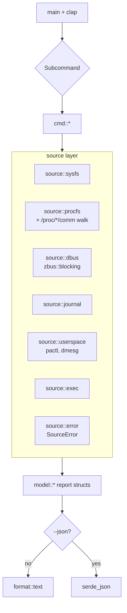
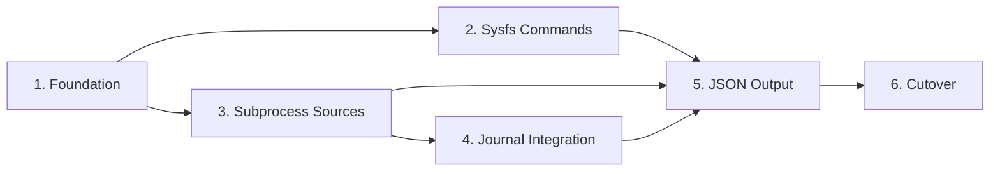

# powercfg Rust Rewrite

## Overview

Replaces the existing 1353-line `powercfg.py` with a Rust binary of the same name. Preserves the CLI surface (`requests`, `lastwake`, `devicequery`, `sleepstates`, `waketimers`, `energy` with `-v`, `-n`, `--enabled-only`) and default text output verbatim, then adds a `--json` global flag that the Python tool lacks.

The Python source is deleted in the cutover phase. There is no coexistence period, no `legacy/` folder, no parity script. Git history retains the old code.

## Architecture

See `Designs/RustRewrite/README.md` for the full architecture document. Summary:

Phase progression follows sysfs surface complexity: pure-sysfs commands first, then subprocess-heavy commands, then journal integration, then JSON, then cutover.

Phases 2 and 3 can run in parallel after Phase 1 lands.

## Key Decisions

All major technical decisions are documented in the design (`Designs/RustRewrite/README.md`). Plan-level decisions:

- **Phasing by sysfs surface, not by alphabetical command order.** Cheaper-to-build commands first means the parsing infrastructure stabilizes before D-Bus/subprocess complexity lands.
- **One PR per phase, sometimes per task within a phase.** Small reviewable diffs over a single mega-PR.
- **No interim binary name.** The Rust binary is `powercfg` from day one; `Cargo.toml` ships with that name. Python file stays in tree until Phase 6 — they are different files (`powercfg.py` vs `target/debug/powercfg`) so there is no name collision during development.
- **Snapshot-test the text output from Phase 1 onward.** `insta` snapshots are the source of truth for "did we accidentally change the human-readable format" — there is no Python parity script to lean on.
- **JSON is its own phase, not bolted onto each command's PR.** Lets each command land on its own merits first; serialization is a single sweeping change.
- **Don't carry Python idioms into Rust.** Where Python shells out to a CLI tool to query systemd, Rust uses `zbus` (typed D-Bus). Where Python shells out to `pgrep`, Rust walks `/proc/*/comm`. Where Python returns empty collections to signal failure, Rust returns `Result<T, SourceError>`. The Python implementation is a behavior reference, not a structural one.

## Dependencies

External:
- Rust toolchain (stable, edition 2024 — verify `cargo build` succeeds before Phase 1 lands).
- `clap` v4, `chrono`, `serde`, `serde_json`, `tracing`, `tracing-subscriber`, `anyhow`, `thiserror` (for `SourceError`), `zbus` (with `blocking` feature, default features off where possible to minimize the transitive set), `tempfile` (test-only), `assert_cmd` (test-only), `insta` (test-only). One subprocess-timeout helper: `wait-timeout` if it builds cleanly, otherwise an in-tree thread+kill helper (~30 lines).
- Linux runtime tools (only needed for end-to-end testing on dev machines, not for build): D-Bus system bus running, `journalctl`, `pactl`, `dmesg`. The Python tool's reliance on `systemd-inhibit`, `systemctl`, and `pgrep` binaries is dropped — Rust talks to the same data via D-Bus and `/proc` directly.

Prerequisites in this repo:
- `Designs/RustRewrite/README.md` approved (currently `status: review`).

Assumptions:
- The dev machine has a working systemd userspace and a battery (or the dev runs against the `sys-headless` fixture for desktop coverage).
- No existing dependents on `powercfg.py` outside this repo. (User's local symlink at `~/.local/bin/powercfg` will need re-creating after cutover; documented in Phase 6.)

Prerequisite for first-time contributors:
- Before running integration tests in Phase 1+, capture fixture data from real hardware using `scripts/capture_fixtures.sh` if `tests/fixtures/sys-typical/` and `tests/fixtures/sys-headless/` are absent. Phase 1 task 1.4 creates the script and the initial fixture; later phases extend it.
